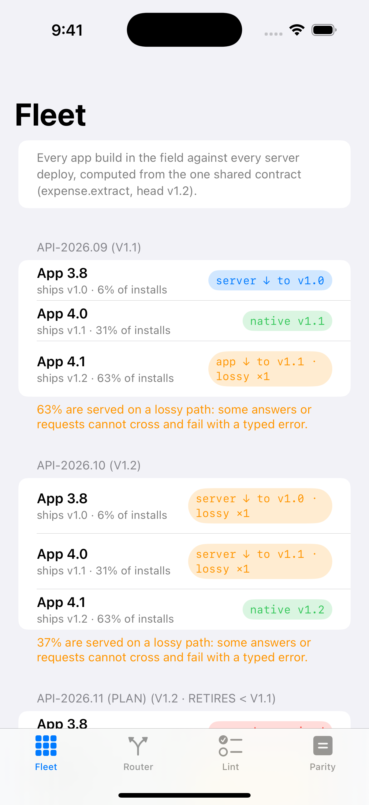
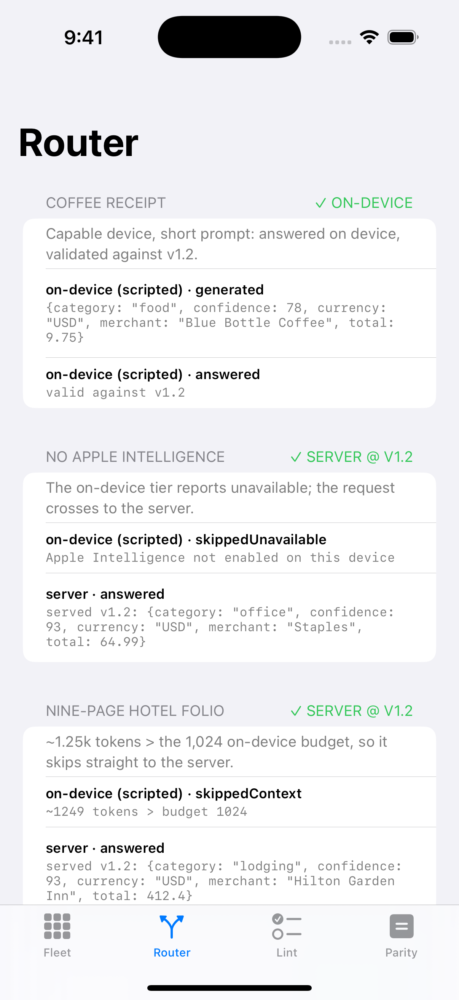
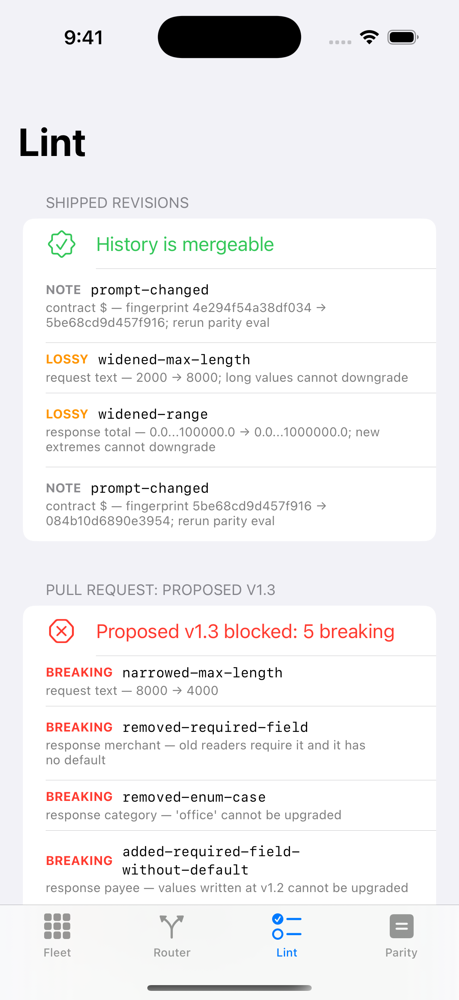
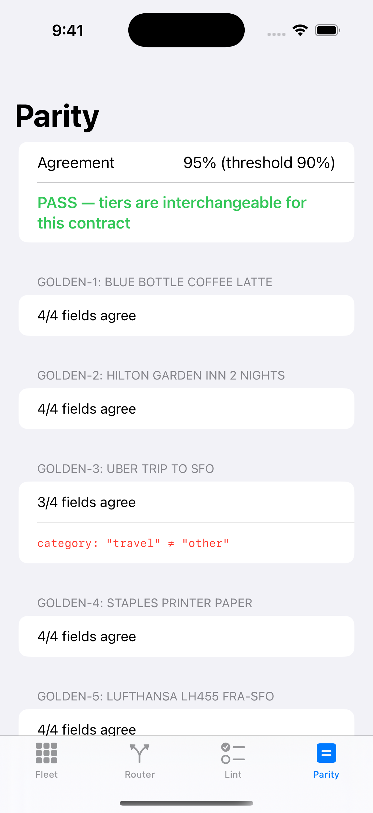
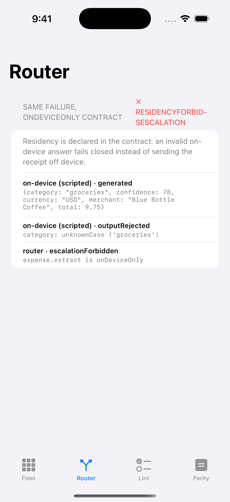
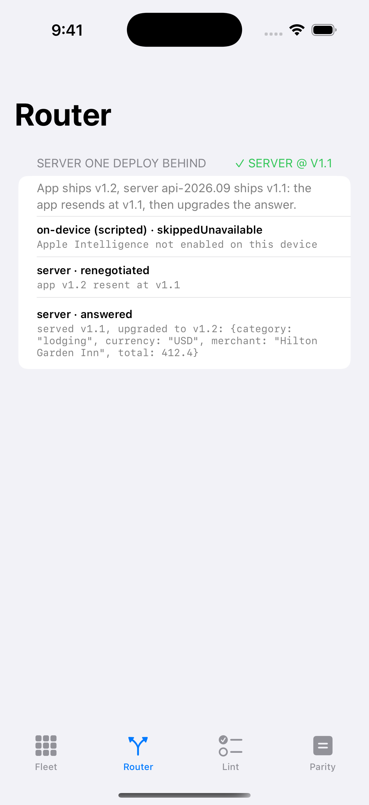
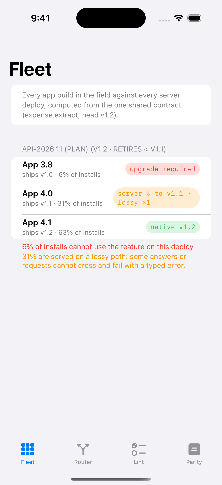

# Contract Console: FeatureContracts demo app

**Three app versions, two server deploys and a planned third, two models, one contract. This app shows which combinations are actually safe, and why.**

A SwiftUI app that consumes [**FeatureContracts**](https://github.com/rajatslakhina/feature-contract-kit) as a **remote Swift package with a release requirement** (`upToNextMajorVersion` from `1.0.1`, never a branch or a local path; no `Package.resolved` is committed, so a fresh clone resolves the newest 1.x). It runs the library against a realistic AI feature, a receipt extractor with three shipped contract revisions, and renders what a lead needs to see before shipping a schema change or rolling a server.

## Why this matters

Sharing one Swift package between an iOS app and a Swift server gives you a single *definition* of an AI feature's output schema. It does not stop the app fleet and the server rollout from running *different revisions* of that definition at the same time. This console makes that skew visible: who gets served, who gets an "upgrade required", which model answered, and whether the two models even agree.

## Screenshots

These are real captures of the app running on an **iOS Simulator on a GitHub-hosted `macos-15` runner** (Xcode 16.4). CI builds the app, installs it, launches it once per screenshot, checks that the app's process is still running (a numeric PID) after each launch, takes the screenshot and commits it back. They were **not** taken on the author's Mac (see Verification).

The first four show the top of each tab. The last four use the app's own launch filters (`-routes`, `-servers`) to bring below-the-fold content on screen, one scenario per shot: the rejected on-device answer, the `onDeviceOnly` fail-closed path, the v1.1 renegotiation, and the planned deploy that breaks 6% of installs.

| Fleet | Router | Lint | Parity |
|---|---|---|---|
|  |  |  |  |

| Rejected on-device answer → server | `onDeviceOnly`: fails closed | App ahead: renegotiates to v1.1 | Planned `api-2026.11` retirement |
|---|---|---|---|
|  |  |  |  |

## What each tab shows

| Tab | What you see | Library types behind it |
|---|---|---|
| **Fleet** | App 3.8 / 4.0 / 4.1 (6% / 31% / 63% of installs, contract v1.0 / v1.1 / v1.2) against `api-2026.09` (v1.1), `api-2026.10` (v1.2) and a planned `api-2026.11` that retires v1.0. Every cell says `native`, `server ↓` (the server downgrades its answer), `app ↓` (the app resends at an older revision), `upgrade required`, or one of those plus `lossy` (amber): served, but the downgrading side crosses a declared-lossy widening. App 4.1 on `api-2026.09` is one of these, because its long requests, like the nine-page folio, cannot be expressed at v1.1. The planned deploy shows the **6% of installs it would break**, and each footer gives the share served on a lossy path (63%, 37% and 31% respectively). | `CompatibilityMatrix`, `Negotiation` |
| **Router** | Six scripted requests through `TierRouter`, each with its full decision trace: a short receipt answered on-device; a device without Apple Intelligence; a nine-page folio (~1.25k tokens) over the 1,024-token on-device budget; an on-device answer that invents the category `"groceries"`, gets rejected and is answered by the server; an app one revision ahead of the server that renegotiates to v1.1 and upgrades the answer; and the same invalid answer under an `onDeviceOnly` contract, which **fails closed instead of sending the receipt off the device**. | `TierRouter`, `ContractClient`, `ContractEndpoint` (in-process), `Validator`, `SkewTranslator` |
| **Lint** | The shipped history (v1.0 → v1.2) passes, with two `lossy` widenings and the prompt fingerprints. A proposed v1.3 "tidy-up" is blocked by five breaking findings: a narrowed input limit, a renamed field, a removed enum case, and two required fields with no default. | `ContractLinter` |
| **Parity** | Five golden receipts through the server fixture and the on-device fixture. 19 of 20 compared fields agree (95% ≥ 90% threshold, so **PASS**); the one disagreement (`Uber`: `travel` vs `other`) is listed. | `ParityEval` |

**About the models:** both are deterministic `ScriptedModel` fixtures (keyword extraction over the rendered prompt). This app does not call Foundation Models or any hosted LLM. What it shows is the contract, skew, routing and validation machinery around a model, end to end.

## How the app uses the package

`Demo/DemoApp.swift` owns every product decision the library leaves open: the three contract revisions (`ReceiptContract`), the proposed v1.3, the fleet, the routing budget, the parity rules and threshold. It hands them to `ContractConsoleView` from `FeatureContractsUI`. The client and server halves are wired together through `InProcessTransport`, so the full wire protocol (envelopes, negotiation, renegotiation, translation) runs on every request. Only the network is skipped.

## How to run it

1. `git clone https://github.com/rajatslakhina/feature-contract-kit-demo-app.git`
2. Open `Demo.xcodeproj` in Xcode 16 or later. Xcode resolves `feature-contract-kit` from GitHub: the newest 1.x at or above 1.0.1.
3. Select the **Demo** scheme and any iPhone Simulator (iOS 17+).
4. Build and run. Optional launch arguments, under *Scheme → Run → Arguments*: `-tab router` (or `fleet`, `lint`, `parity`) lands on a tab; `-routes invalid,skew,private` shows only those router scenarios; `-servers api-2026.11` shows only matching server deploys.

## Verification

What actually happened, stated separately:

- **Resolves and compiles against the released package, on CI.** The `resolve-and-build` job in this repo's [Actions](https://github.com/rajatslakhina/feature-contract-kit-demo-app/actions) resolves `feature-contract-kit` from GitHub. On the run for the current requirement, it resolved **1.0.1** (revision `0cc9c34`). The job then builds the `Demo` scheme for `generic/platform=iOS Simulator` with Xcode 16.4.
- **Ran on a Simulator, on CI.** The `run-on-simulator` job builds for a concrete iPhone simulator and installs the app. It then launches it eight times: `-tab fleet|router|lint|parity`, then `-routes invalid`, `-routes private`, `-routes skew` and `-servers api-2026.11`. After each launch it confirms the app's process is still running with a numeric PID, and it commits the eight screenshots above. Together the screenshots show every headline interaction this README describes.
- **Not run on the author's Mac.** In this unattended run, computer-use access to Xcode and Simulator *was* granted. But Xcode already had an unrelated project open, so by rule nothing was touched. Nobody has tapped through the app by hand.
- **The scenario logic is tested off-device too.** Everything the console shows comes from `ContractConsole` in the library, which is covered by the library's 61 tests on Linux and macOS. The scenario in `DemoApp.swift`, filters included, was also run headless on Linux against the library before pushing, and its output matches the numbers in this README.
- **Independent review:** three rounds by fresh Opus reviewers. Every finding from the first two rounds was fixed and re-checked by the next round. The round-3 findings were fixed too (the public `RemoteAnswer` initializer, one scenario per screenshot, stale counts), but no fourth review was run, because the task caps review at three rounds. Details are in the [library README](https://github.com/rajatslakhina/feature-contract-kit#verification).

## License

MIT. See [LICENSE](LICENSE).
